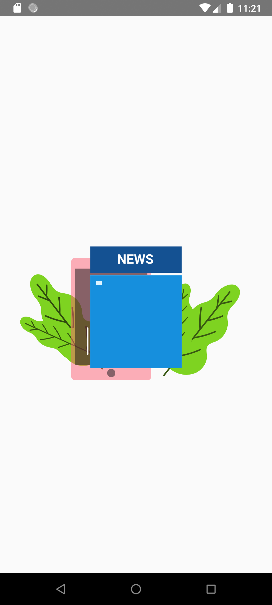
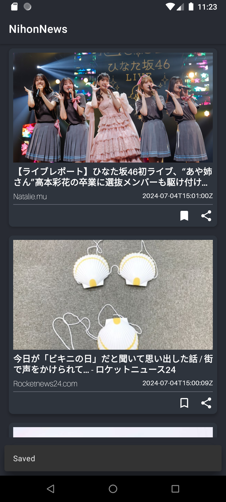
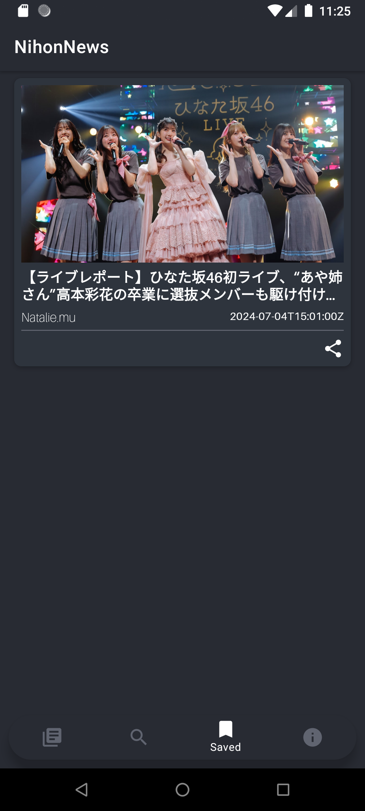

# VIX-Schoters-ZaenalArif / NihonNews

  

# Table Of Contents

- [Introduction](#introduction)
- [Demo](#demo)
- [Tech Stack](#tech-stack)

## Introduction

For more details.

- English

> NihonNews is a news application that provides the latest and relevant information from Japan. With
> a clean and easy-to-use interface, NihonNews ensures you stay up-to-date with the latest news from
> various categories such as entertainment, technology, culture and more.

- Indonesia

> NihonNews adalah aplikasi berita yang memberikan informasi terkini dan relevan dari Jepang. Dengan
> antarmuka yang bersih dan mudah digunakan, NihonNews memastikan Anda tetap up-to-date dengan berita
> terbaru dari berbagai kategori seperti hiburan, teknologi, budaya, dan banyak lagi.

## Demo
| Splash                                                  | Home Page                                       | Detail Page                                         | Search Page                                         | Saved Page                                        | About Page                                        |
|---------------------------------------------------------|-------------------------------------------------|-----------------------------------------------------|-----------------------------------------------------|---------------------------------------------------|---------------------------------------------------|
|  |  |  |  |  |  |

 | Preview                                               |
 |-------------------------------------------------------|
 |  |
## Tech Stack

- [Kotlin](https://kotlinlang.org/): First class and official programming language for Android development.
- [Coroutine](https://kotlinlang.org/spec/asynchronous-programming-with-coroutines.html#coroutines): Kotlin library for asynchronous and concurrent programming, providing support for suspending functions. 
- [LifeCycle](https://developer.android.com/topic/libraries/architecture/lifecycle?hl=en): Components to handle Android lifecycle-aware tasks, including ViewModel and LiveData support. 
- [Glide](https://github.com/bumptech/glide): An image loading and caching library for Android focused on smooth scrolling
- [Material Design](https://material.io/develop/android/docs/getting-started): Material is a design system created by Google to help teams build high-quality digital experiences for Android, iOS, Flutter, and the web.
- [ROOM](https://developer.android.com/jetpack/androidx/releases/room?hl=en): A persistence library that provides an abstraction layer over SQLite to allow for more robust database access while harnessing the full power of SQLite.
- [Shimmer-Android](https://github.com/facebookarchive/shimmer-android): Library to add a shimmering effect to any view in your Android app, enhancing UI interactions.
- [CircleImageView](https://github.com/hdodenhof/CircleImageView): Custom ImageView that displays images as circles, useful for avatar or profile picture views.
- [Retrofit](https://github.com/square/retrofit): A type-safe HTTP client for Android and Java used to handle REST API calls and network requests in a concise and efficient manner.