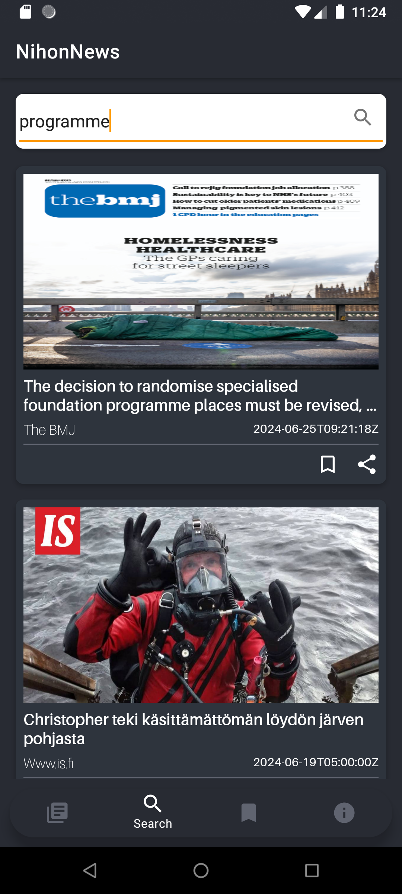
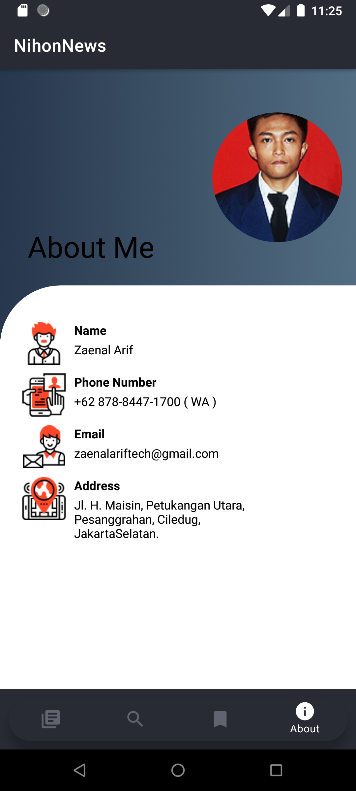

# VIX-Schoters-ZaenalArif / NihonNews

  

# Table Of Contents

- [Introduction](#introduction)
- [Demo](#demo)
- [Tech Stack](#tech-stack)

## Introduction

For more details.

- English

> NihonNews is a news application that provides the latest and relevant information from Japan. With
> a clean and easy-to-use interface, NihonNews ensures you stay up-to-date with the latest news from
> various categories such as entertainment, technology, culture and more.

- Indonesia

> NihonNews adalah aplikasi berita yang memberikan informasi terkini dan relevan dari Jepang. Dengan
> antarmuka yang bersih dan mudah digunakan, NihonNews memastikan Anda tetap up-to-date dengan berita
> terbaru dari berbagai kategori seperti hiburan, teknologi, budaya, dan banyak lagi.

## Demo

| Splash                                     | Home Page                              | Detail Page                              | Search Page                              | Saved Page                              | About Page                              
|--------------------------------------------|----------------------------------------|------------------------------------------|------------------------------------------|-----------------------------------------|-----------------------------------------|
|  |  |  |  |  |  |

## Tech Stack

- [Kotlin](https://kotlinlang.org/) - First class and official programming language for Android
  development.
- [Glide](https://github.com/bumptech/glide) - An image loading and caching library for Android
  focused on smooth scrolling
- [Material Design](https://material.io/develop/android/docs/getting-started) - Material is a design
  system created by Google to help teams build high-quality digital experiences for Android, iOS,
  Flutter, and the web.
- [LottieFiles](https://lottiefiles.com/) - LottieFiles provides all the tools that you need to
  create, edit, test and display Lottie animations.